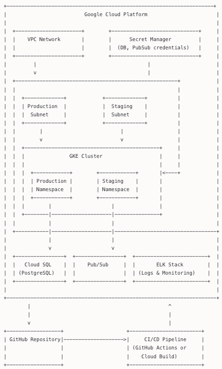

# Cache: DevOps Engineer Assessment

This repository contains a secure, production-grade infrastructure setup on Google Cloud Platform (GCP) for a simple application that integrates with Pub/Sub, PostgreSQL, and ELK Stack, with CI/CD support via GitHub.

## Architecture Overview

The infrastructure follows industry best practices and SOC 2 compliance requirements:

- **VPC Network**: Isolated network with separate subnets for staging and production
- **GKE Cluster**: Kubernetes cluster with separate staging and production namespaces
- **PostgreSQL**: Cloud SQL instance with private access
- **Pub/Sub**: Topic and subscription for asynchronous messaging
- **ELK Stack**: Elasticsearch, Logstash, and Kibana for log aggregation and analysis
- **CI/CD**: GitHub Actions and/or Cloud Build for automated deployments
- **Secret Management**: Google Secret Manager for secure credential storage
- **Access Control**: Least privilege principle for IAM roles
- **Bastion Host**: For secure access to the cluster, simulating VPN access



## Application

The application is a simple Python Flask API that provides:

- `/health` endpoint for health checks
- Integration with PostgreSQL for data persistence
- Integration with Pub/Sub for message publishing
- Logging to ELK stack for observability
- Auto-scaling support in Kubernetes

## Project Structure

```
├── .github/
│   └── workflows/
│       └── ci-cd.yml        # GitHub Actions workflow
├── terraform/
│   ├── main.tf              # Main Terraform configuration
│   ├── variables.tf         # Terraform variables
│   ├── elk.tf               # ELK stack setup
│   └── kubernetes.tf        # Kubernetes resources
├── app/
│   ├── app.py               # Application code
│   ├── requirements.txt     # Python dependencies
│   └── Dockerfile           # Docker build instructions
├── cloudbuild.yaml          # Cloud Build configuration
├── README.md                # This file
└── infra-docs.md            # Documentation on IAM, secrets, audit, SOC 2
```

## Setup Instructions

### Prerequisites

- [Google Cloud SDK](https://cloud.google.com/sdk/docs/install)
- [Terraform](https://www.terraform.io/downloads.html) (v1.0.0+)
- [kubectl](https://kubernetes.io/docs/tasks/tools/)
- [Python](https://www.python.org/) (v3.9+)
- GCP Account with Owner or Editor permissions

### Setup Steps

1. **Clone the repository**

   ```bash
   git clone https://github.com/your-org/cache-devops-assessment.git
   cd cache-devops-assessment
   ```

2. **Set up Google Cloud Configuration**

   ```bash
   # Login to Google Cloud
   gcloud auth login

   # Set the project ID
   gcloud config set project YOUR_PROJECT_ID

   # Enable required APIs
   gcloud services enable compute.googleapis.com \
       container.googleapis.com \
       servicenetworking.googleapis.com \
       sqladmin.googleapis.com \
       secretmanager.googleapis.com \
       pubsub.googleapis.com \
       cloudbuild.googleapis.com
   ```

3. **Initialize Terraform and Apply Configuration**

   ```bash
   cd terraform

   # Initialize Terraform
   terraform init

   # Create a terraform.tfvars file with your configuration
   cat > terraform.tfvars << EOF
   project_id           = "YOUR_PROJECT_ID"
   region               = "us-central1"
   zone                 = "us-central1-a"
   project_prefix       = "cache"
   db_password          = "YOUR_SECURE_PASSWORD"
   bastion_allowed_cidr = "YOUR_IP_ADDRESS/32"
   EOF

   # Plan Terraform changes
   terraform plan -out=tfplan

   # Apply Terraform changes
   terraform apply tfplan
   ```

4. **Configure kubectl to connect to the GKE cluster**

   ```bash
   gcloud container clusters get-credentials cache-gke-cluster --zone us-central1 --project YOUR_PROJECT_ID
   ```

5. **Create an Artifact Registry repository**

   ```bash
   gcloud artifacts repositories create app-registry \
       --repository-format=docker \
       --location=us-central1 \
       --description="Docker repository for app images"
   ```

6. **Build and push the application**

   ```bash
   cd ../app

   # Build the Docker image
   docker build -t us-central1-docker.pkg.dev/YOUR_PROJECT_ID/app-registry/app:latest .

   # Configure Docker for Artifact Registry
   gcloud auth configure-docker us-central1-docker.pkg.dev

   # Push the image
   docker push us-central1-docker.pkg.dev/YOUR_PROJECT_ID/app-registry/app:latest
   ```

7. **Set up Cloud Build**

   - Grant necessary permissions to the Cloud Build service account:

     ```bash
     # Get the Cloud Build service account email
     PROJECT_ID=YOUR_PROJECT_ID
     SERVICE_ACCOUNT=$(gcloud projects describe $PROJECT_ID --format='value(projectNumber)')@cloudbuild.gserviceaccount.com

     # Grant the necessary role for GKE access
     gcloud projects add-iam-policy-binding $PROJECT_ID \
         --member=serviceAccount:$SERVICE_ACCOUNT \
         --role=roles/container.developer

     # Grant artifact registry access
     gcloud projects add-iam-policy-binding $PROJECT_ID \
         --member=serviceAccount:$SERVICE_ACCOUNT \
         --role=roles/artifactregistry.admin

     # Grant Secret Manager access
     gcloud projects add-iam-policy-binding $PROJECT_ID \
         --member=serviceAccount:$SERVICE_ACCOUNT \
         --role=roles/secretmanager.secretAccessor
     ```

   - Trigger a Cloud Build pipeline:

     ```bash
     gcloud builds submit --config=cloudbuild.yaml \
         --substitutions=_NAMESPACE=staging,_TAG=latest
     ```

8. **Set up GitHub Actions**

   - Create a GCP service account for GitHub Actions:

     ```bash
     # Create service account
     gcloud iam service-accounts create github-actions \
         --display-name="GitHub Actions"

     # Assign necessary roles
     gcloud projects add-iam-policy-binding YOUR_PROJECT_ID \
         --member="serviceAccount:github-actions@YOUR_PROJECT_ID.iam.gserviceaccount.com" \
         --role="roles/container.developer"

     gcloud projects add-iam-policy-binding YOUR_PROJECT_ID \
         --member="serviceAccount:github-actions@YOUR_PROJECT_ID.iam.gserviceaccount.com" \
         --role="roles/storage.admin"

     gcloud projects add-iam-policy-binding YOUR_PROJECT_ID \
         --member="serviceAccount:github-actions@YOUR_PROJECT_ID.iam.gserviceaccount.com" \
         --role="roles/artifactregistry.admin"

     # Create and download key
     gcloud iam service-accounts keys create key.json \
         --iam-account=github-actions@YOUR_PROJECT_ID.iam.gserviceaccount.com
     ```

   - Add the following secrets to your GitHub repository:
     - `GCP_PROJECT_ID`: Your GCP project ID
     - `GCP_SA_KEY`: The content of the downloaded `key.json` file (base64 encoded)

8. **Access the application and Kibana**

   ```bash
   # Get Ingress IP for the application in staging
   kubectl -n staging get ingress app-ingress -o jsonpath='{.status.loadBalancer.ingress[0].ip}'

   # Get Ingress IP for the application in production
   kubectl -n production get ingress app-ingress -o jsonpath='{.status.loadBalancer.ingress[0].ip}'

   # Get Ingress IP for Kibana
   kubectl -n elk get ingress kibana -o jsonpath='{.status.loadBalancer.ingress[0].ip}'
   ```

   Access the applications in your browser:
   - Application: `http://<ingress-ip>`
   - Kibana: `http://<kibana-ingress-ip>:5601`

## Testing the Application

The application provides the following endpoints:

- `GET /health` - Health check endpoint
- `POST /api/events` - Create a new event (requires JSON body with `message` field)
- `GET /api/events` - List all events

Example:

```bash
# Health check
curl http://<app-ingress-ip>/health

# Create an event
curl -X POST http://<app-ingress-ip>/api/events \
  -H "Content-Type: application/json" \
  -d '{"message": "Hello, world!"}'

# Get all events
curl http://<app-ingress-ip>/api/events
```

## Local Development

For local development:

```bash
# Create a virtual environment
python -m venv venv
source venv/bin/activate  # On Windows: venv\Scripts\activate

# Install dependencies
pip install -r requirements.txt

# Run the application
python app.py

# Run tests
pytest
```

## Cleanup

To clean up all resources:

```bash
cd terraform
terraform destroy
```

## Additional Documentation

Refer to [infra-docs.md](infra-docs.md) for detailed information on:
- IAM roles and policies
- Secret management
- Audit logging
- SOC 2 compliance alignment